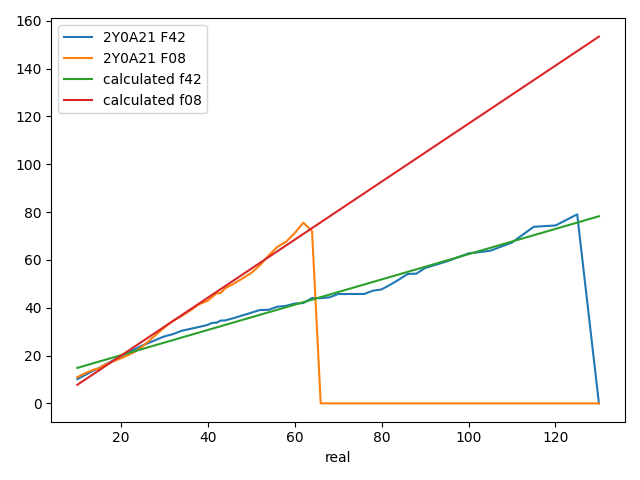

# IAM
A tool designed to help public waste management services monitor and empty public trash cans.

This project is project is being developed for the INFOM453 class (Laboratoire en **I**nformatique **A**mbiante et **M**obile) at [UNamur](https://www.unamur.be/en) (BE).

## Getting started

### Agent development

**IAM** uses the concept of agent to monitor trash cans. An agent is a device whose purpose is to monitor a single trash can state and to notify the server when changes occur. Insofar as this implementation goes, you may either go for the Raspberry route or the Arduino route. Both paths are now detailed.

#### Raspberry
##### Installation

Prerequisites:
1. Get a [Raspberry Pi](https://www.raspberrypi.org/), any version should be sufficent;
2. Get a **2Y0A21 F42** distance sensor;
3. Get a **2Y0A21 F08** distance sensor.

When the prerequisites are satisfied, proceed to the [phidget python library](https://www.phidgets.com/docs/Language_-_Python) installation on the raspberry:
```bash
mkdir -p libphidget22
wget -q https://www.phidgets.com/downloads/phidget22/libraries/linux/libphidget22.tar.gz -O - | gunzip -c - | tar xf - -C "${PWD}/libphidget22" --strip-components 1
cd libphidget22
./configure && make
sudo make install
sudo ldconfig
sudo cp "${PWD}/libphidget22/plat/linux/udev/99-libphidget22.rules" /etc/udev/rules.d/
```

After which you may have to reboot the raspberry. Once this is done you may proceed to the python dependencies installation:

```bash
cd ${PROJECT_ROOT}/raspberry
pip install -r requirements.txt
```

##### Callibration

Sensors do not provide accurate results out of the box. If `f` details the function that outputs the accurate results and `g` represents the sensor raw data, the `c` is the callibration function such that `c ∘ g = f`. This callibration function is (roughly) defined as follow:

1. Get the sensor raw data (an example of this is available in the `raspberry/data/raw_calibration_measurement.csv` file);
2. Find the function that best fits the sensor data (find `g`);
3. Find the transform from `g` to `f` (i.e. `c`). Given that our function is linear, this is equivalent to finding the slope factor and y-intercept that separates `g` and `f`.
4. Apply `c` to `g` at runtime, i.e. for every sensor measurement `x`, apply the slope factor `m` and y-interpect `c` such that `y = mx + c`.
5. Send `y` to the server.

The `raspberry/calibration.py` (and its output `raspberry/parameters.json`) detail steps 2 and 3. Step 4 is realised in the `get_corrected_value` function in `raspberry/phidgets.py` by loading the `raspberry/parameters.json` file.

The transformation for our captors looks as follow:




#### Arduino
TODO

### Web development

#### With Docker:

Prerequisites:
1. Have [docker](https://docs.docker.com/engine/install/) installed;
2. Have [docker-compose](https://docs.docker.com/compose/install/) installed.

When the prerequisites are satisfied, run:

```bash
docker-compose up -d
```

You're done! Drink a cup of coffee while backend and frontend sources are compiled and then head to [localhost:8000](http://localhost:8000)!
The migrations, backend and frontend logs can be respectively found in `migrations.log`, `backend.log` and `frontend.log`.

#### Without Docker:

Prerequisites:
1. Have a [Java Runtime Environment](https://www.java.com/en/download/) version 8 or superior;
2. Have [SBT](https://www.scala-sbt.org/download.html) installed;
3. Have [NodeJS](https://nodejs.org/en/download/) and NPM installed;
4. Have a [MySQL](https://www.mysql.com/downloads/) or [MariaDB](https://mariadb.org/download/) server available.

##### Running migrations
When the prerequisites are satisfied, you may run the migrations with the following command:
```bash
cd ${PROJECT_ROOT}/backend
sbt "run migrate \
    --database-host $DB_HOST \
    --database-port $DB_PORT \
    --database-schema $DB_SCHEMA \
    --database-user $DB_USER \
    --database-password $DB_PASSWORD
"
```
Where variables are replaced with the chosen installation details.

##### Running the development server
```bash
cd ${PROJECT_ROOT}/backend
sbt run
```
If everything was setup properly, you should now be able to reach the website at [localhost:8000](http://localhost:8000)

##### Compiling frontend assets
Executing the following
```bash
cd ${PROJECT_ROOT}/frontend
npm ci
npm run build
```
will compile frontend assets and output the result to the `public/build` directory. If you wish to recompile on every change, you may replace `npm run build` by `npm run dev`. When the assets have been prepared, we need to add the resulting files to the backend `resources` folder for server delivery:
```bash
mkdir backend/target/scala-2.12/assets
cp -R frontend/public/. backend/target/scala-2.12/assets
```
If you wish to automate the process you may either use a watcher such as inotify or simply link the two folders.
